# Twitter_Classification
This NLP classification model aims to predict Twitter users’ political inclinations by scraping their tweets. 
This model is training by scraping the Twitter accounts of all 508 Congress members whose politics are already known.
If further developed, this model could be utilized to identify other users’ politics (on a scale) for the purpose of targeting specific messages to them.
After EDA, I created two models comprising of nearly 10,000 features, based on the most common words, which went through tokenization and stemming.
Both models aim to predict if the user is a Democrat or a Republican.
The model makes this prediction based on single tweets, whereas the second does that based on all tweets made by the user over the past five months.

Using the Library “Twint”, I scraped all the tweets of the US Congress members (House & Senate) between January 1, 2019, and June 12, 2019.

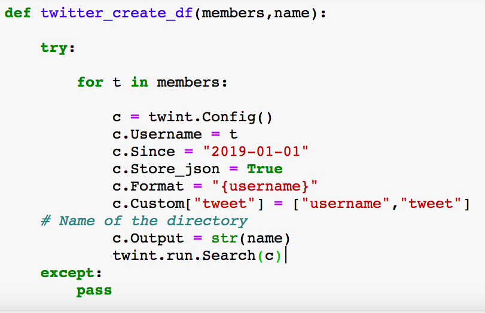

A
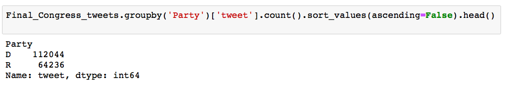

A
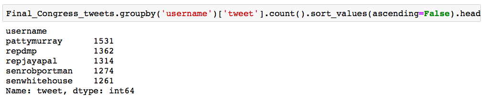
A
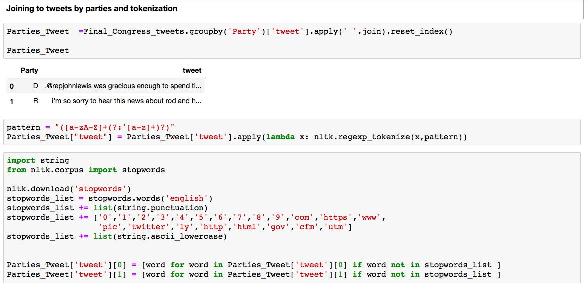

a
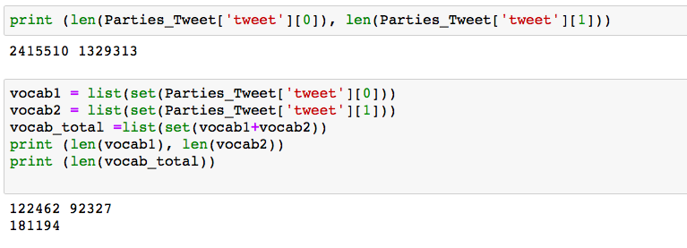
a
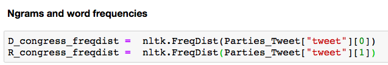
a
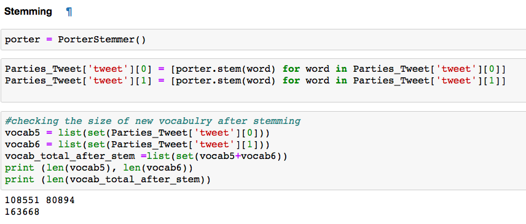
a
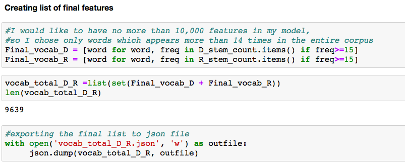
a
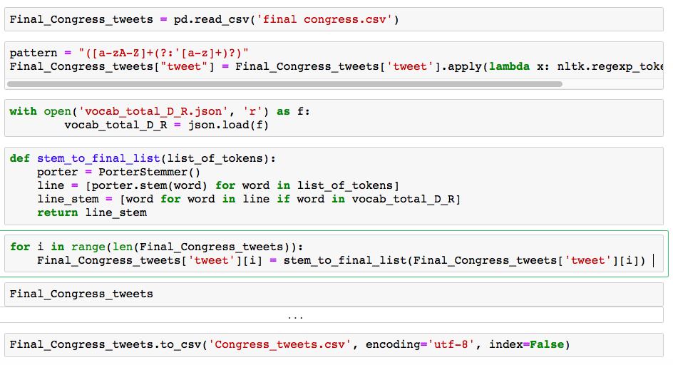
a
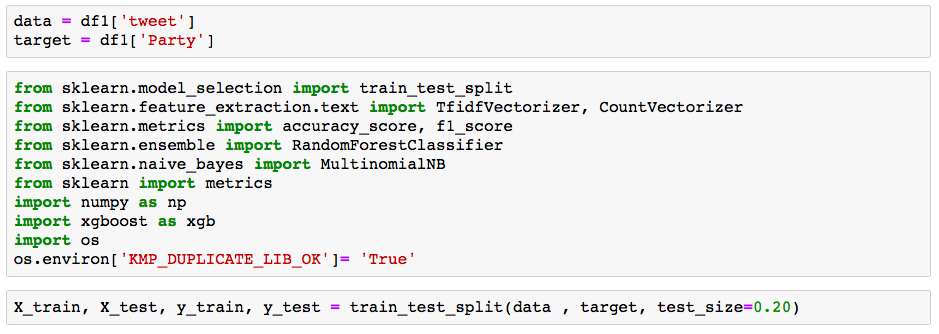
a
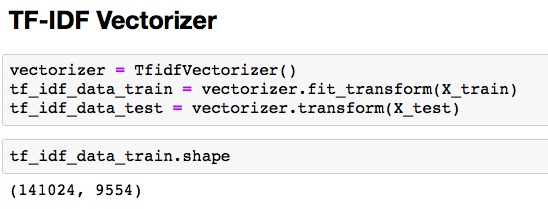
a
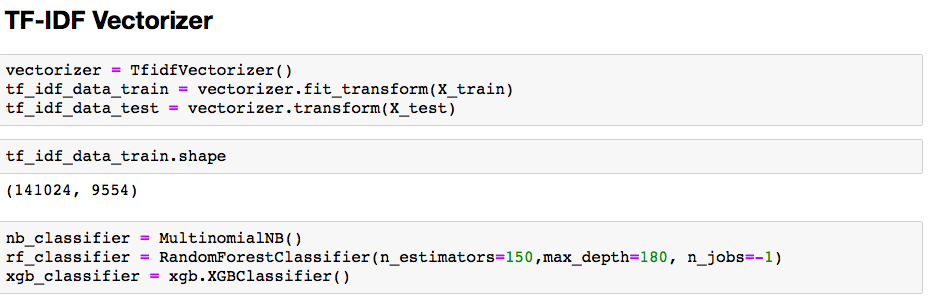
a
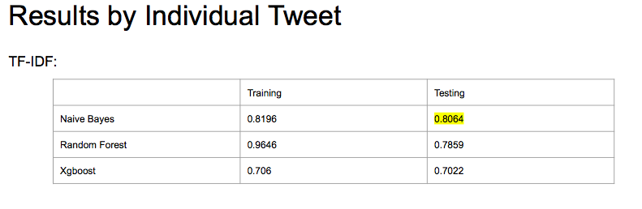
a
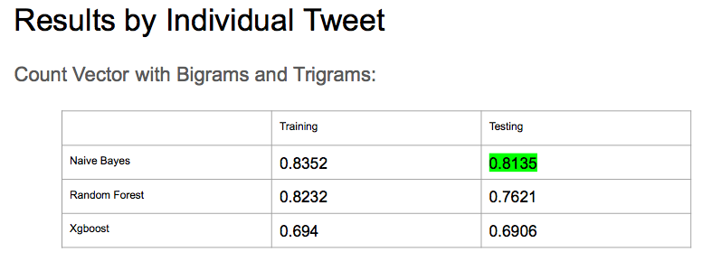
a
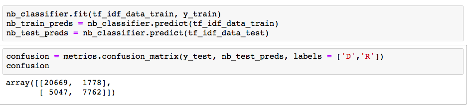
a
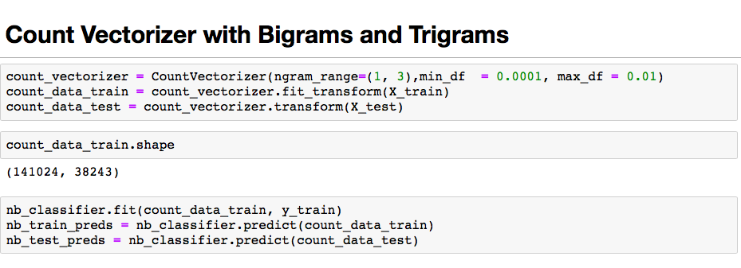
a
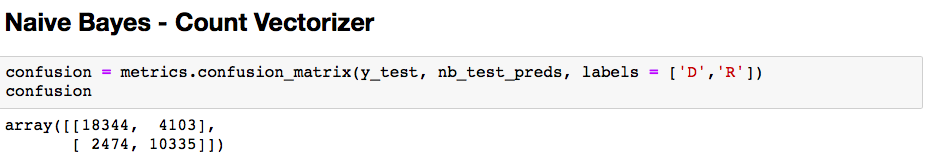
a
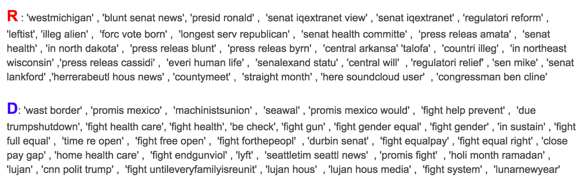
a
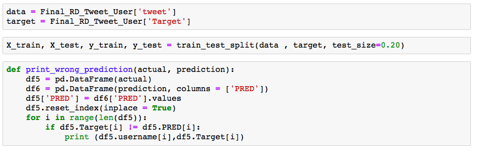
a
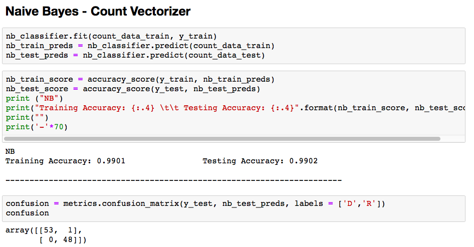
a
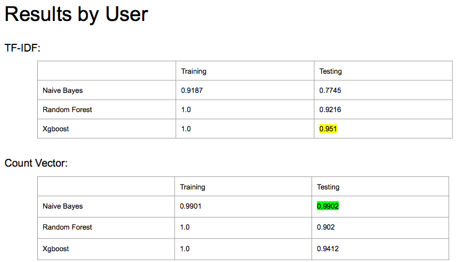
a
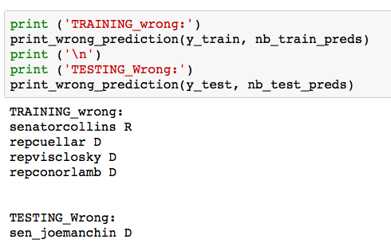
a

a
