# PoliTwitting
## Twitter-based NLP Classifications
This NLP classification model aims to predict Twitter users’ political views based on the contents of their Twitter accounts (tweets).
This model is trained by scraping the Twitter accounts of 508 US Congress members. 
The first step in building the model was applying an EDA which included tokenization, stemming, and exclusion of stopwords. The EDA yielded nearly 10,000 features, selected based on the most common words in the corpus.   
After the EDA, I compared two methods of word vectorizion: Count Vector and TF-IDF, by applying three algorithms to them: Naive Bayes, Random Forest and XGBoost. The ultimate combination of word vectorization method & algorithm was identified for each of the two sub-models created in this project: the single tweet-based predicition, and the user's past five months' tweets-based prediction.

This model, if further developed, will be able to identify other users’ politics, and even place them on a scale (as opposed to simply determine R or D).  That ability should be vaulable for targeting specific messages to users based on their politics.

Following is a summary of the process of creating the model.
_____
Using the Library “Twint”, I scraped all the tweets of the US Congress members (House & Senate) between January 1, 2019, and June 12, 2019. For the Twitter accounts names I used the website "Tweet Congress": http://www.tweetcongress.org/home. I saved all the tweets on a json file.

One of the most predomonent things about the EDA, is that Democrat Congress Members tweet more than Republicans ones. 267 Democrats posted 112,044 tweets during the period in question, wheareas 241 Democrats posted 64,236 tweets.

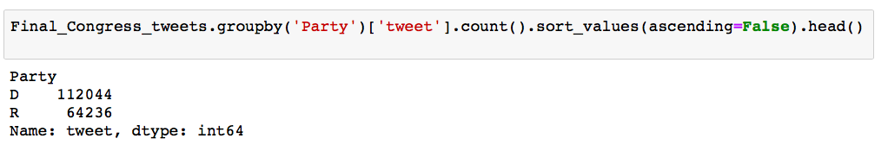

From the top 5 of the  Congressman with  highest number of Tweets ( for the time being researched), 4 are democrats (Patty Murray, Debbie Mucarsel Powell, Pramila Jayapal, Sheldon Whitehouse) and only one is a republican (Rob Portman).

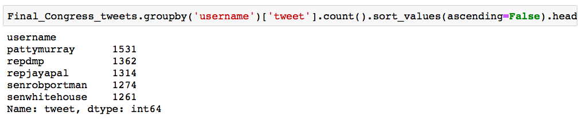

I decided to have approximately 10,000 features/stem-words in my future model. Therefore, I used different NLP methods with the Library NLTK. I first merged all the twits of the democrats to one list and all the republican tweets to another list. I then used Tokenization and exclude stop words.

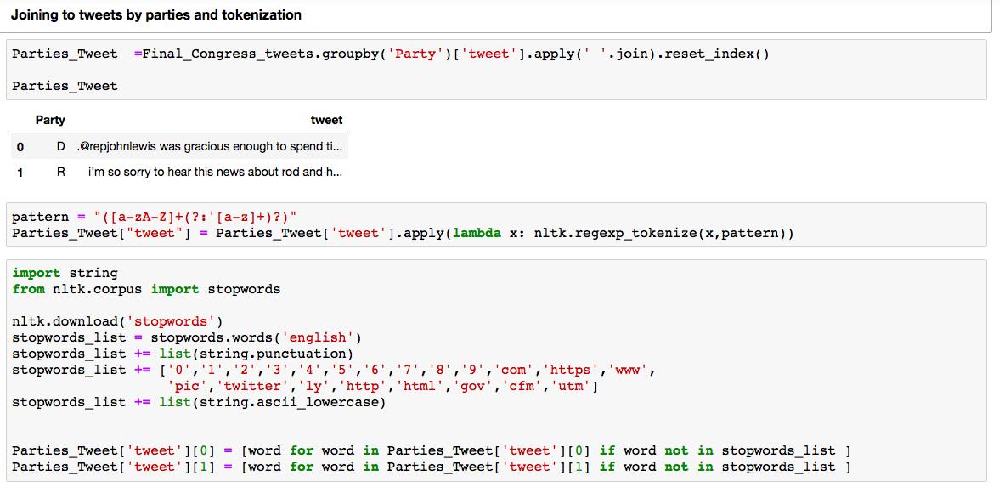

After exluding the list of stop words i created, the total number of words was 3,744,823. The total vocabulry of the entire corpus was still relatively big: 181,194 words. 

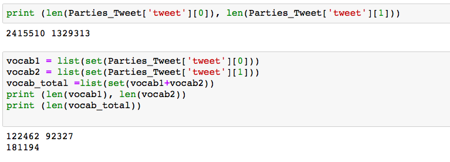

I did some research regarding the most common unique words and bigrams in each group:

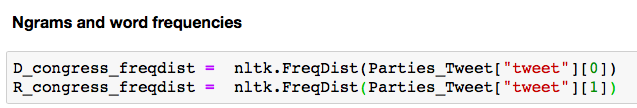
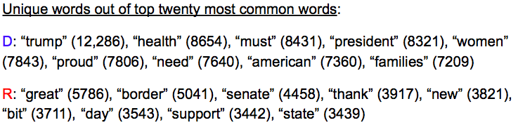
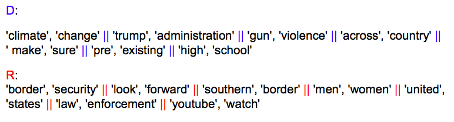

In order to reduce the number of words and create more efficient model, I used the Porter Stemming Algorithm over the tokenized words:

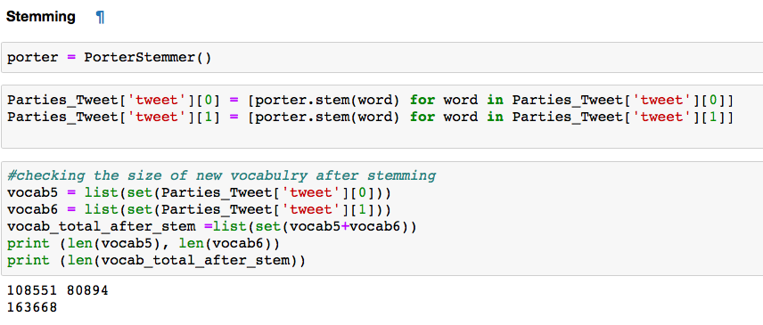

My next step was selecting all the words which appear more than 14 times in each party's tweets corpus, and created my final list of 9639 features. The list was saved as Json file. 

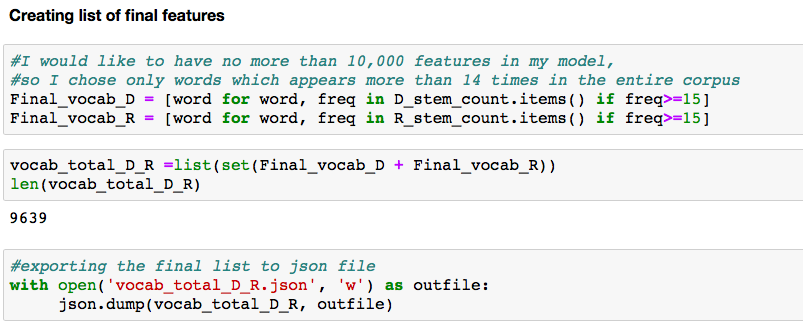

After selecting the final features ,  I created the data frame which will be used in my models. I used again tokenization and stemming algorithm to fit my data frame  with the list of  the selected features.

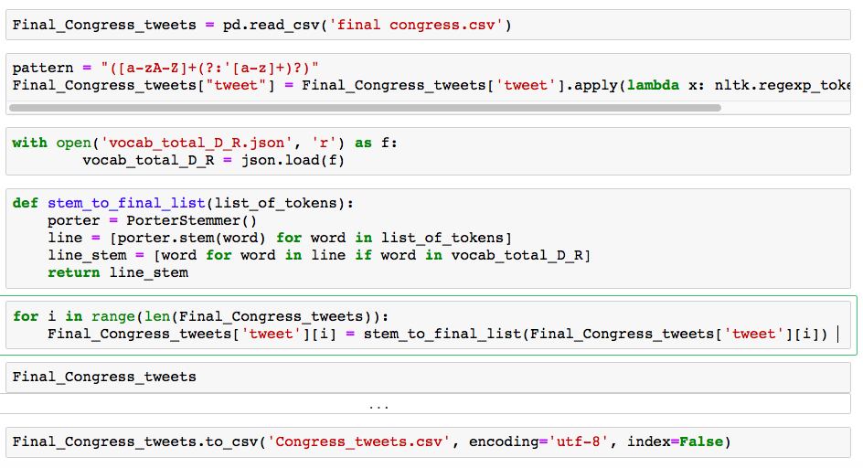

To be able to train and validate the model, I will used Sklearn Train_Test_Split method. I split the data frame to data and target.

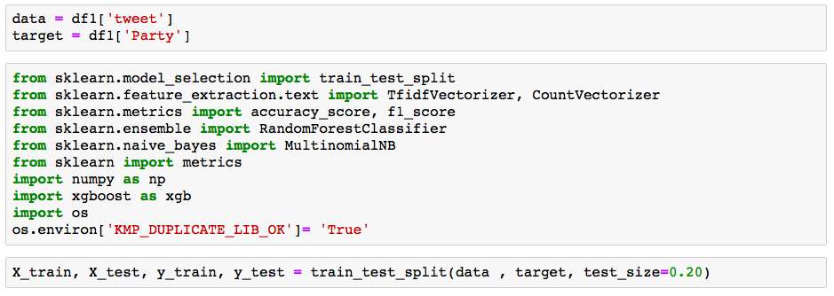

The first method of word vectorization I tested was TF-IDF (term frequency–inverse document frequency). I checked three different classifier: Multinomial Naive Bayes, Random Forest and XGBoost.

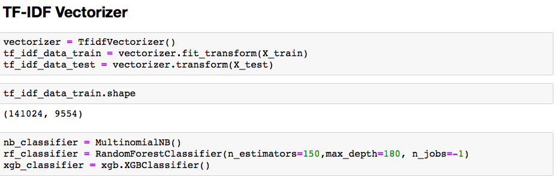

Summary of the results:

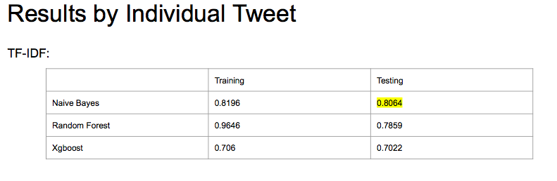

Confusion matrix (Left-Democrats, Right- Republicans) for the most accurate model (Naive Bayes):

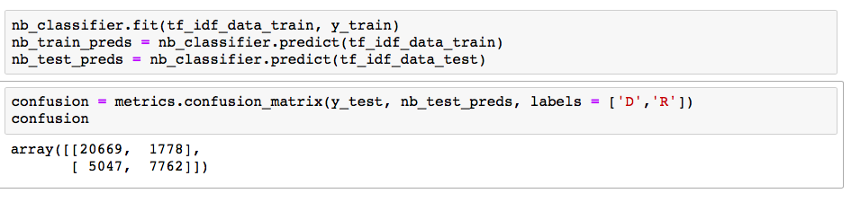

Another NLP method I tested was Count Vectorization (including bigrmas and trigrams) with scikit-learn. I checked again three different classifier: Multinomial Naive Bayes, Random Forest and XGBoost.

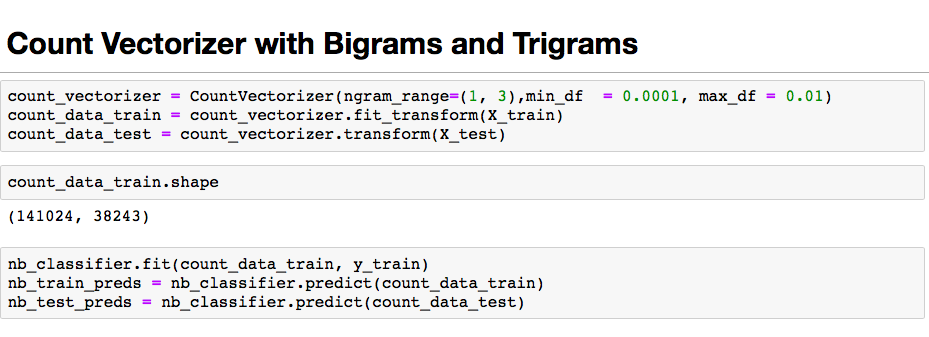

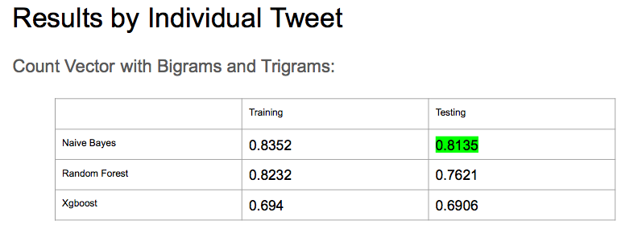

Also with the count vector the Naive Bayes had the best results with the following confusion matrix:

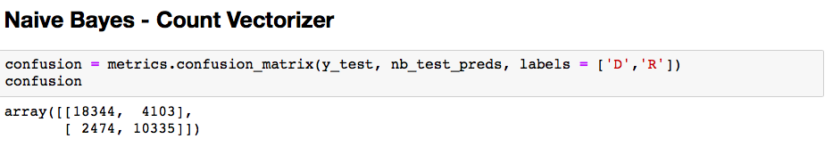

These are the top 35 features with the highest probability toward each side:

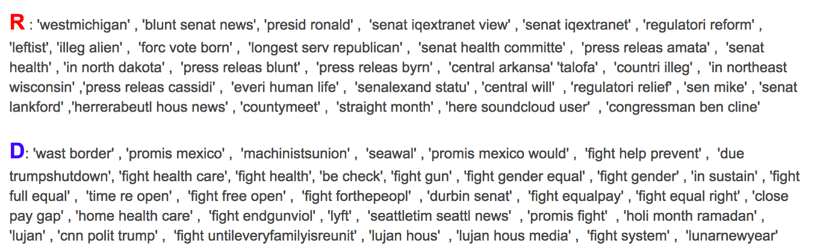

I followed the same process, but this time based the prediction on all the tweets of individual user in the last 5 months.

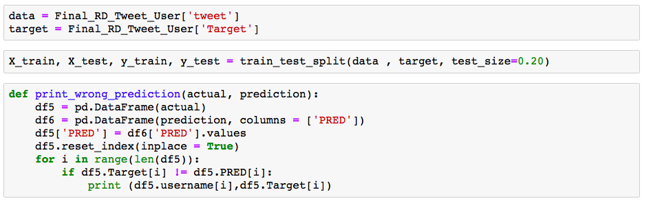

The results of the Naive Bayes and count vector were the most accurate.

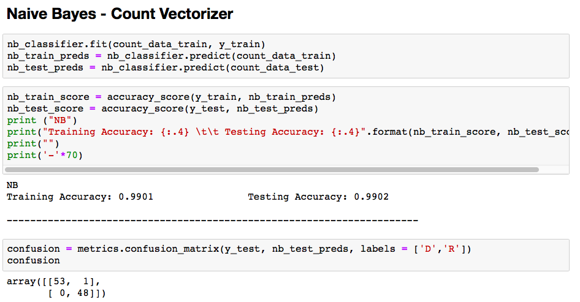

Here is a summary of all the classifier and methods I used:

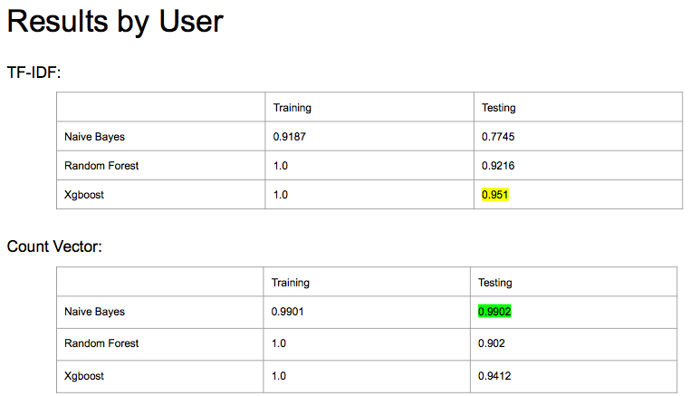

It is interesting to see who are the congress members were the model miss-classified. some of them are to be either progressive republicans are conservative democrats. 

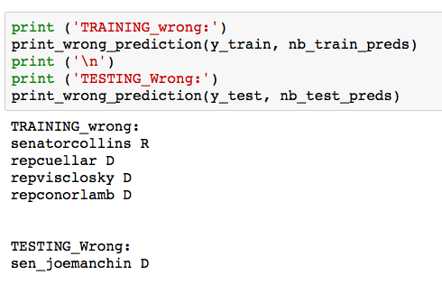
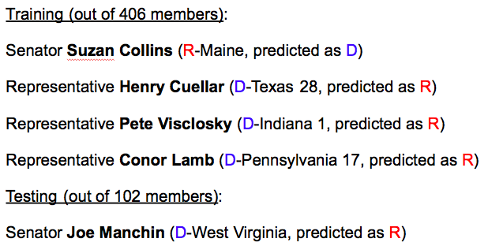

These are the top 35 features with the highest probability toward each side (per user model):

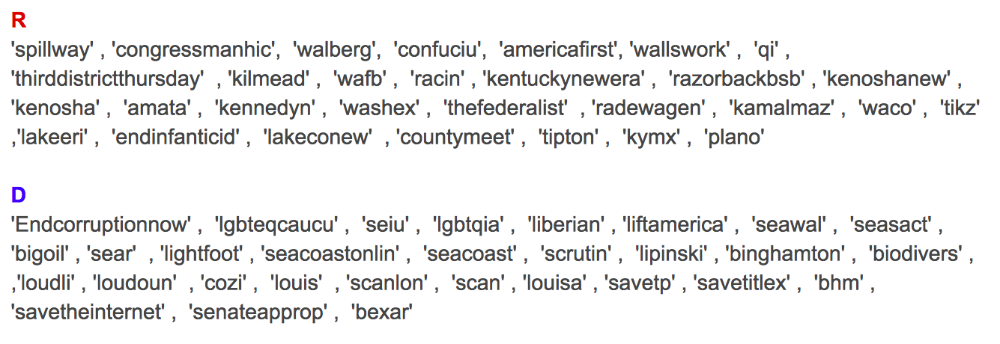

Future development: In this model, I used a simple R vs. D classification, but future models can also use cosine similarity and other methods to check difference between users and therefore be utilized for targeted messaging.
Twint is also able to scrape followers, retweets and additional features that could potentially be layered into this model.

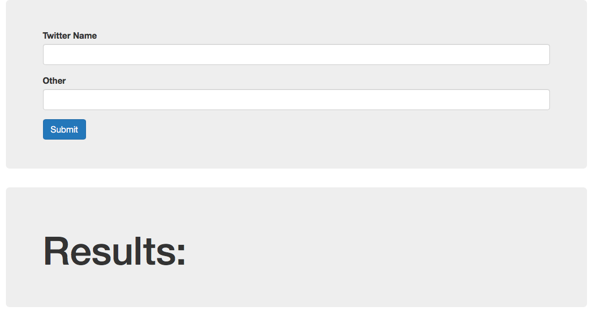

